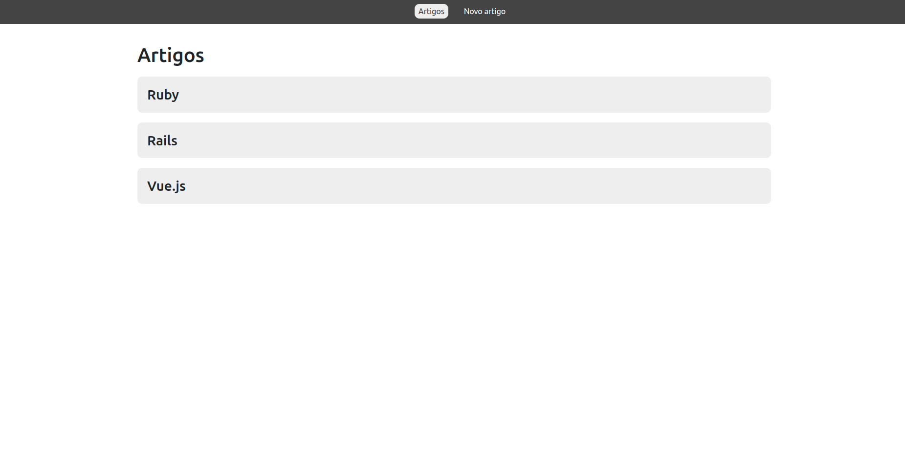
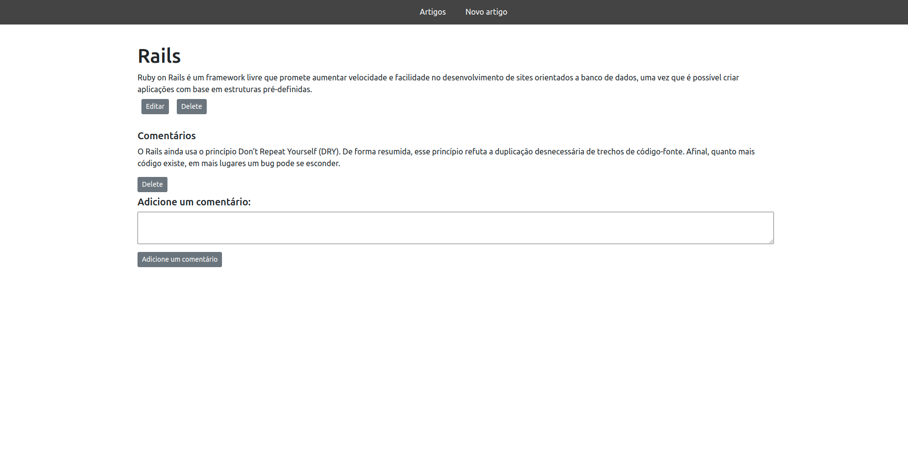

<h2> Blog Web</h2>

<h3>Hello guys</h3>

 A Vue.js project

 You can: 

<ul>
  <li> Add articles</li>
  <li> Edit your articles</li>
  <li> Create comments</li>
  <li> Delete one or all</li>
</ul>
 

Take a look at the API: <a href = https://github.com/MorganaDuarte/blog-api> Blog API </a> 

Project create for study!

